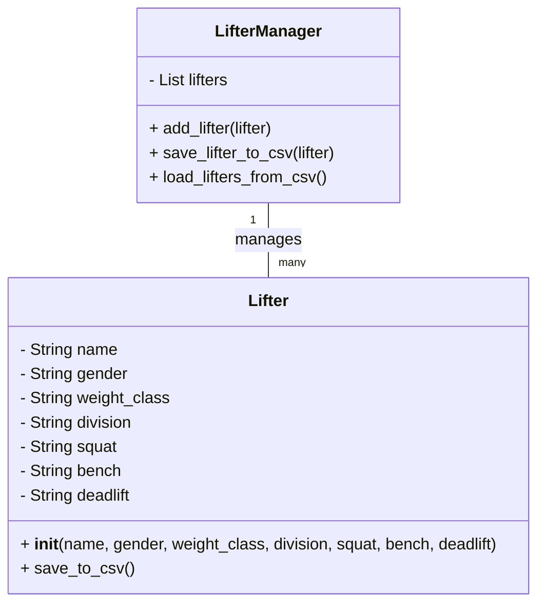

# Powerlifting Meet Registration App
Wada Tafesse
4.30.2025

## Project Introduction

The Powerlifting Meet Registration App allows powerlifters to register for competitions by entering their personal information and first attempts for the squat, bench, and deadlift events. Additionally, lifters can view a roster of all registered participants within their division. The app provides a simple and intuitive graphical user interface (GUI) for lifters to sign up, enter their attempts, and view other competitors' details. 

The target users of this app are powerlifters, coaches, and event organizers who need a streamlined way to register lifters, track their first attempts, and organize competition rosters. The app is ideal for local powerlifting events and small competitions.

## Design and Architecture

The app is structured with a clear separation of concerns between the user interface and the logic for managing lifter data. The **Lifter** class represents the individual lifters, and the **LifterManager** class handles the storage and retrieval of lifter data, saving them into a CSV file. The GUI is built using Python's Tkinter library, which provides a simple yet effective interface for users to interact with the app.



## Instructions

### How to Install and Run the App
1. Install Python (version 3.6 or higher) if not already installed.
2. Clone or download this repository to your local machine.
3. Navigate to the project folder in your terminal or command prompt.
4. Install required dependencies by running:
   ```
   pip install tkinter
   ```
5. Run the application by executing:
   ```
   python app.py
   ```

### Key Features
- **Lifter Registration**: Allows lifters to enter their name, gender, weight class, and division type, and register for the event.
- **Attempt Entry**: After registration, lifters can input their first attempts for the squat, bench press, and deadlift.
- **Roster View**: Users can view a roster of all lifters within a specific division, showing details like name, weight class, and attempts.
- **File Handling**: The app saves registered lifters' data in a CSV file, which can be opened and viewed externally.

### How to Test the App
To test the app:
1. Open the app and register a lifter.
2. Enter their squat, bench, and deadlift attempts.
3. Verify that the data is correctly saved in the CSV file.
4. View the roster and ensure that the lifter's information is displayed properly.

## Challenges, Role of AI, Insights

During development, I initially tried using Dart/Flutter to build the app, but encountered several difficulties with crashes and issues that were hard to debug. I then switched to Python, a language I am more familiar with, and found it much easier to identify and fix problems. One challenge I faced was related to saving lifter data to a CSV file. Initially, the app was saving data locally, but I couldn’t get it to generate a CSV file that could be opened. After some debugging, I was able to resolve this...

AI was useful in troubleshooting certain issues. It helped me understand error messages and provided insights on linking features like file handling and graphical UI improvements. However, there were times when the suggestions were partially helpful and required tweaking. Through this process, I learned a lot about GUI design, the importance of a clean and user-friendly interface, and how to handle backend logic for saving and displaying user data.

## Next Steps

If I had more time, I would refactor the app to use Dart/Flutter to make it a web-based application. While I enjoyed working with Flutter, I didn’t have enough time to fully explore it and implement it in the project. Additionally, I would expand the registration form to capture more detailed information, as powerlifting registration is typically much more in-depth than the current version of the app.

In the future, I would like to add features like tracking lifters’ progress over time, integrating a competition scheduling system, and providing leaderboards based on results. These additions would make the app more valuable to powerlifters, coaches, and event organizers.
